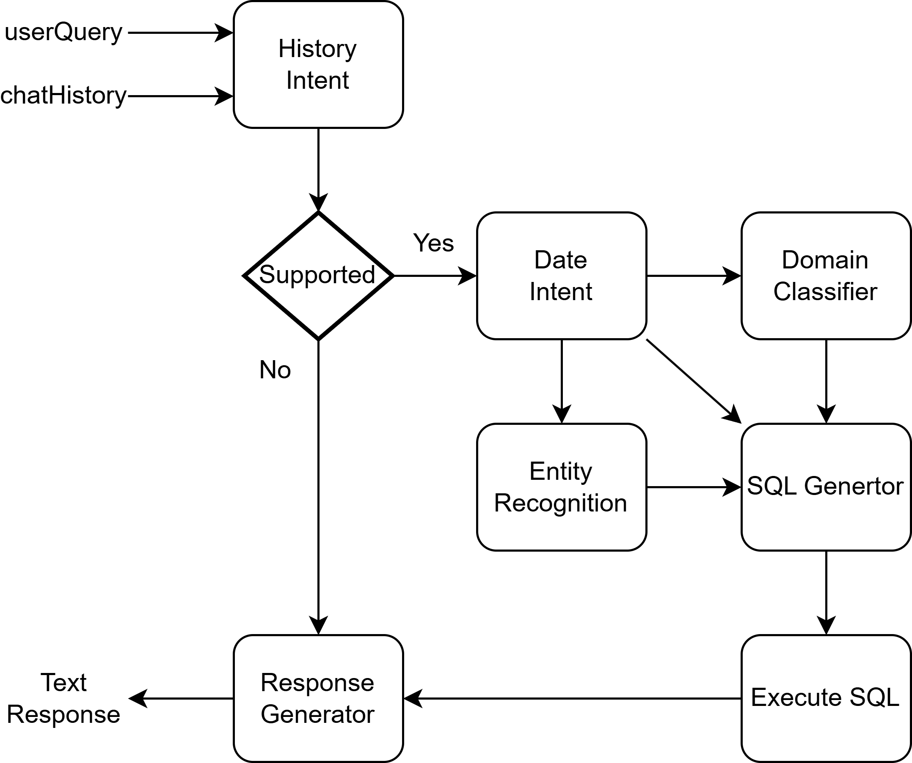

# Text-SQL-Text Implementation (Code is Private)

This repository outlines the workflow for implementing a natural language interface to a project management database. The flowchart below illustrates the sequence for processing user queries, from intent recognition to SQL generation and response formation.

### Workflow Overview
1. **History Intent**: Analyzes the `userQuery` and `chatHistory` to understand context and intent.
2. **Supported Check**: Determines if the user’s query falls within the supported scope.
3. **Intent Processing**:
   - If supported, the system proceeds with `Date Intent`, `Domain Classification`, and `Entity Recognition` to prepare for SQL generation.
4. **SQL Generation and Execution**: Generates SQL commands based on recognized entities and classified domains, then executes them on the database.
5. **Response Generation**: Constructs a natural language response based on the SQL output.

This flowchart and description represent the overall structure. Note that code is private and solely for the client’s use.

---
---

    

